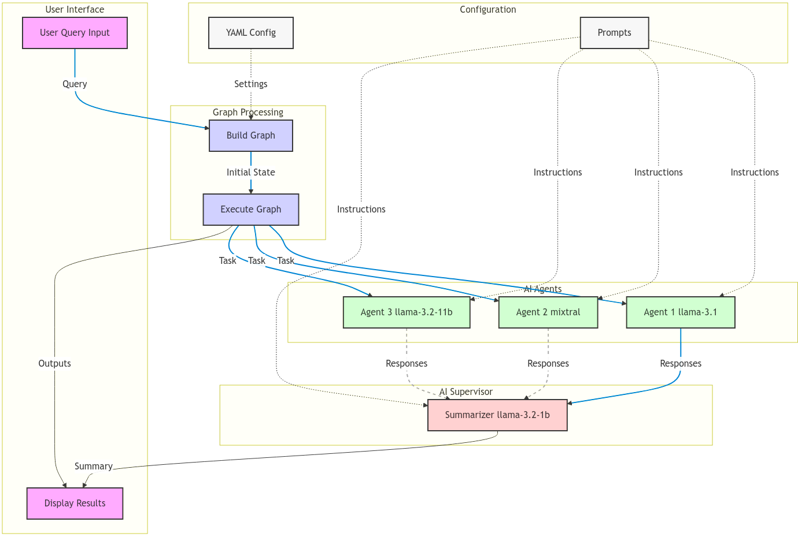

# Hands-On Guide: How Multi-AI Agents Collaborate to Build Winning Product Development Strategies


# How About Real World Travel Agency Using AI Agents

## Introduction

Full Article : [https://medium.com/@learn-simplified/lets-build-enterprise-grade-travel-agency-using-ai-agents-0b746e14e866

## TL;DR:

This article shows you how to build an AI-powered travel planning system. We cover everything from understanding user preferences to creating personalized itineraries using AI. It’s a practical look at how AI can transform the travel industry, making trip planning easier and more personalized than ever before. Whether you’re into tech, business, or just love to travel, you’ll find something interesting here about the future of AI in travel.


## What's This Project About

This article is your backstage pass to building a cutting-edge travel agency powered by AI. We’re going to walk through the process of creating a smart travel planning system that can understand your preferences, search for the best deals, and craft personalized itineraries.

You’ll see how we combine natural language processing, decision-making algorithms, and travel industry data to create an AI assistant that’s like a super-smart, tireless travel agent. From collecting user preferences to suggesting attractions and booking flights, we’ll cover all the steps involved in bringing this AI travel planner to life.

## Why Work on It?

AI is revolutionizing every industry, and travel is no exception. This article gives you a front-row seat to see how AI can transform a traditional business model. Even though we’re using a fictional company, the principles and techniques we discuss are very real and applicable to many businesses.

By reading this, you’ll gain insights into how AI can enhance customer experiences, streamline operations, and open up new possibilities in the travel industry. Whether you’re a tech enthusiast, a business owner, or just curious about the future of travel, this article will give you a valuable perspective on the practical applications of AI in today’s business world.


## Architecture



# Tutorial: How About Real World Travel Agency Using AI Agents 

## Prerequisites
- Python installed on your system.
- A basic understanding of virtual environments and command-line tools.

## Steps

1. **Virtual Environment Setup:**
   - Create a dedicated virtual environment for our project:
   
     ```bash
     python -m venv How-Multi-AI-Agents-Collaborate-to-Build-Winning-Product-Development-Strategies
     ```
   - Activate the environment:
   
     - Windows:
       ```bash
       How-Multi-AI-Agents-Collaborate-to-Build-Winning-Product-Development-Strategies\Scripts\activate
       ```
     - Unix/macOS:
       ```bash
       source How-Multi-AI-Agents-Collaborate-to-Build-Winning-Product-Development-Strategies/bin/activate
       ```
   
# Installation and Setup Guide

**Install Project Dependencies:**

Follow these steps to set up and run the 'Hands-On Guide: How About Real World Travel Agency Using AI Agents' project:

1. Navigate to your project directory:
   ```
   cd path/to/your/project
   ```
   This ensures you're in the correct location for the subsequent steps.

2. Install the required dependencies:
   ```
   pip install -r requirements.txt
   ```
   This command installs all the necessary Python packages listed in the requirements.txt file.


## Run - Hands-On Guide: How About Real World Travel Agency Using AI Agents

   ```bash 
     
      # Run 
      streamlit run app/main.py
      
   ```

## Conclusion and Next Steps

Congratulations! You've just built an How About Real World Travel Agency Using AI Agents.
